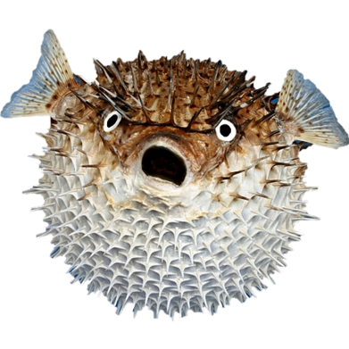

# FishingGame
FishingGame

FishingGame is a simple fishing game developed in Xamarin for Android devices. The objective of the game is to catch as many fish as possible within the given time limit. It features intuitive touch controls and vibrant graphics to provide an enjoyable gaming experience.

Features

    Easy-to-use touch controls for catching fish
    Score tracking system to keep track of your progress
    Timer to challenge yourself within a limited time frame
    Vibrant graphics and immersive sound effects
    Relaxing background music to enhance the gaming experience

Screenshots

Getting Started

To get started with FishingGame, follow these steps:

    Clone the repository:

    git clone https://github.com/Minoxyzzz/FishingGame.git

Open the project in Xamarin and build it using your preferred IDE.

Deploy the game to your Android device or emulator.

Start fishing and try to catch as many fish as you can within the time limit!

Requirements

    Android device or emulator running Android OS 12.0 (Snow Cone) or higher

Contributing

Contributions are welcome! If you find any bugs or have suggestions for improvements, please feel free to submit an issue or create a pull request. Let's make FishingGame even better together!
